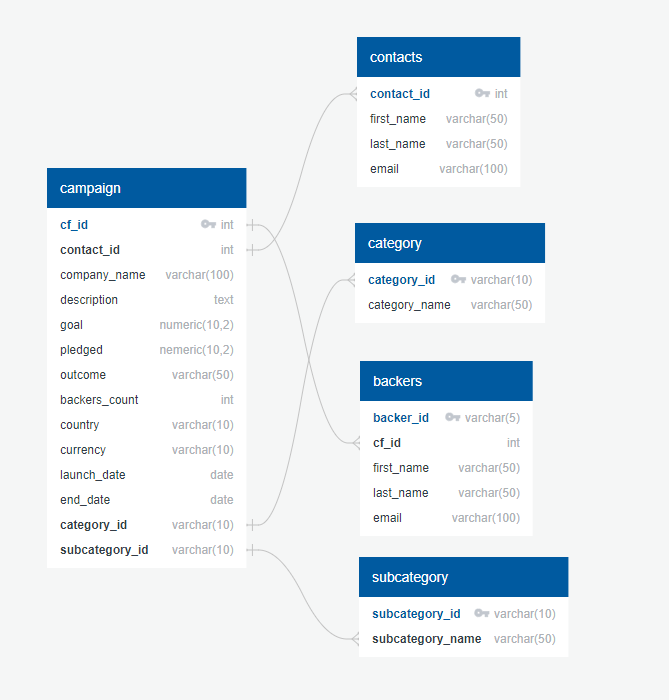

# Crowdfunding-ETL
The new data set that contains information about the backer is analyzed in this code. The Data is extracted, transformed, and cleaned then SQL is used to organize and manage the data.
To extract the data, data is read and cleaned using two methods 1. Using regular expressions (regex) and 2 Using Python dictionary methods (Json) then inserted in a data frame with the help of pandas library. These data frames are exported from Python to a CSV file. Pgadmin and postgress is used to manage old data. The ERD and Table Schema is updated according to the new data. In the following picture, you can find this information.

Finally there was a request to extract emails, names and other information from the data. This is done using quarries and the SQL file is saved for these quarries.
